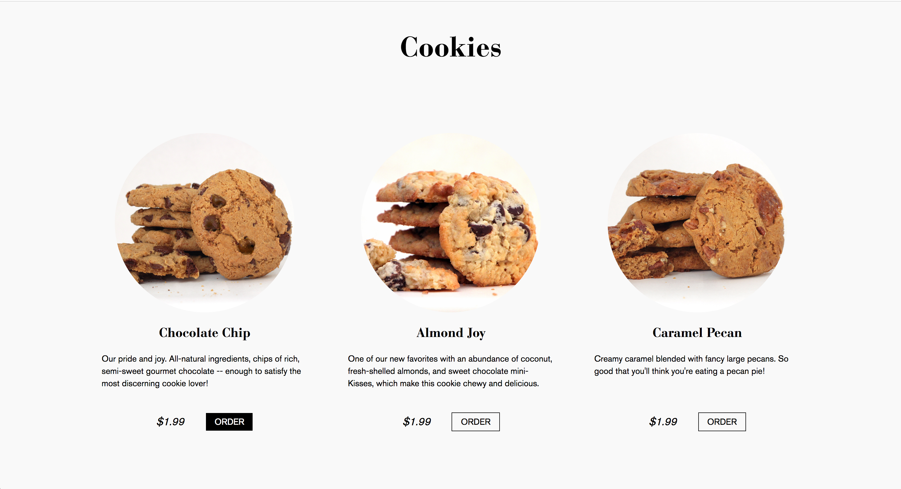
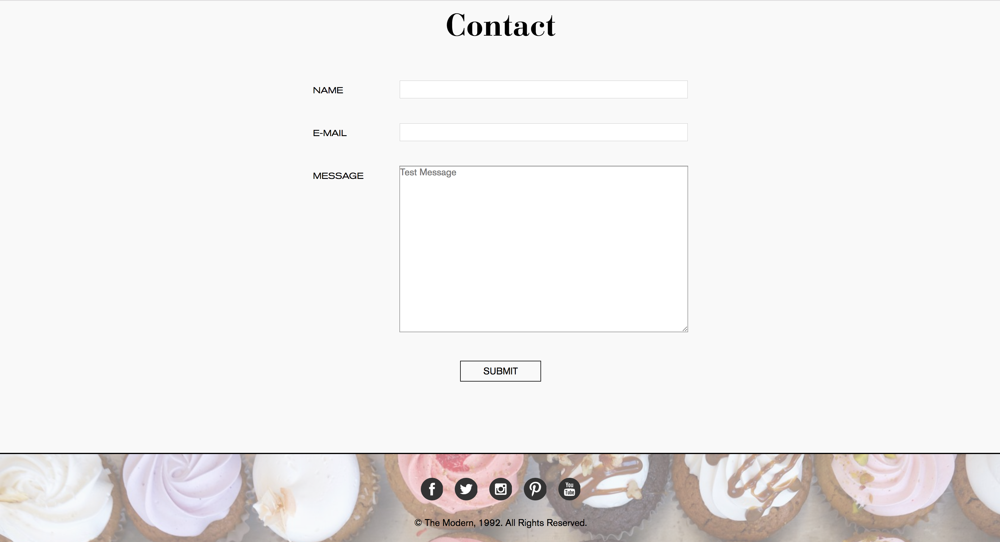

# The Modern

Ruby application for a fictional bakery.

## Site Images

## Built With

* HTML
* CSS / SASS
* Ruby (version 2.5.1)
* Normalize.css

## Authors

* **Michael Chung**

## License

This project is licensed under the MIT License - see the [LICENSE.md](LICENSE.md) file for details

## Acknowledgments

* NYCDA
* Oggi Danailov
